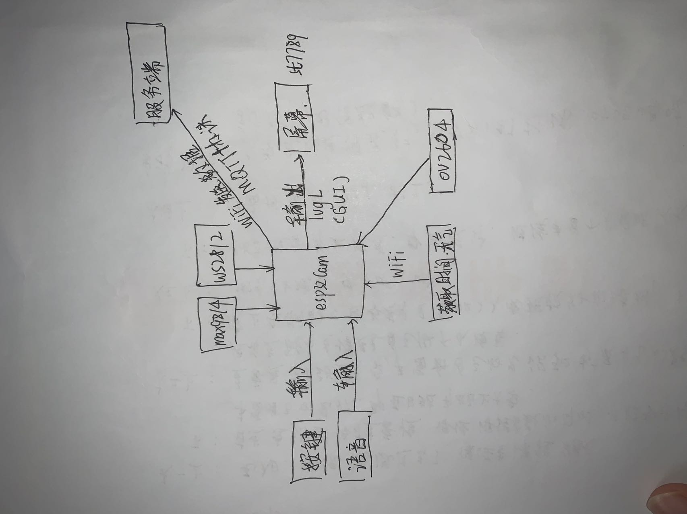
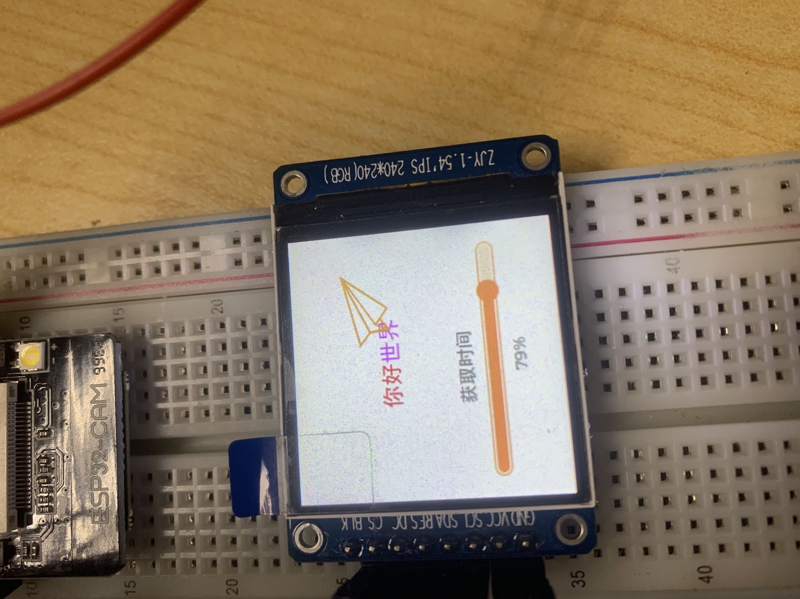
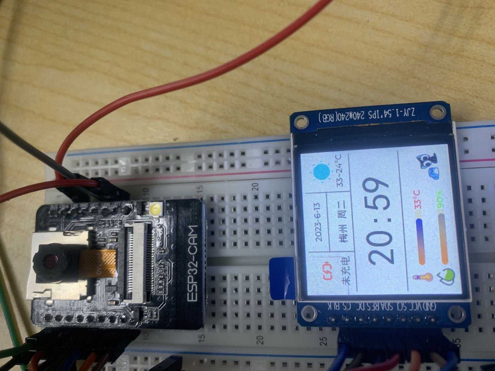
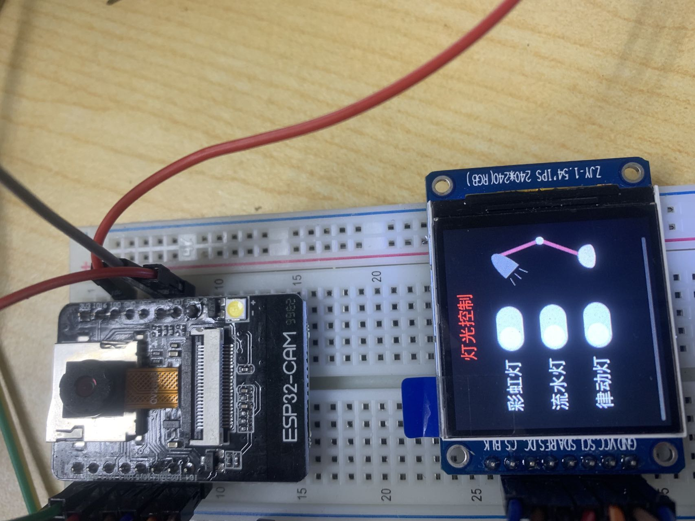
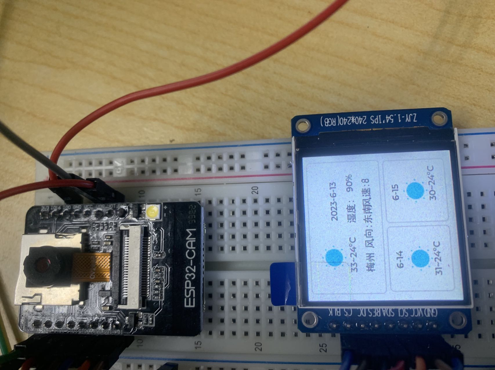
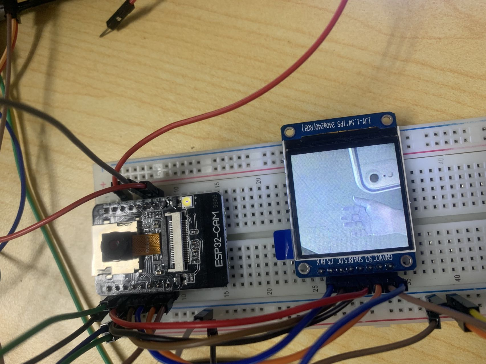
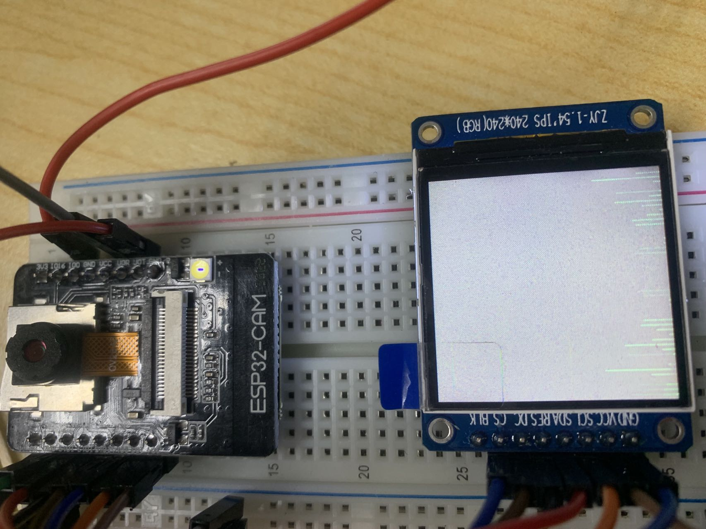
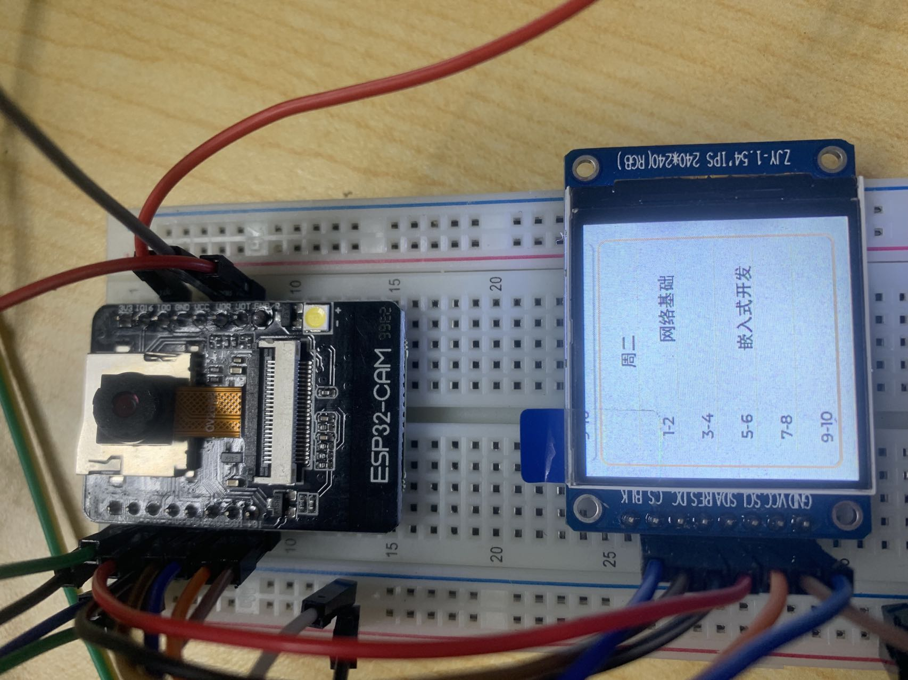
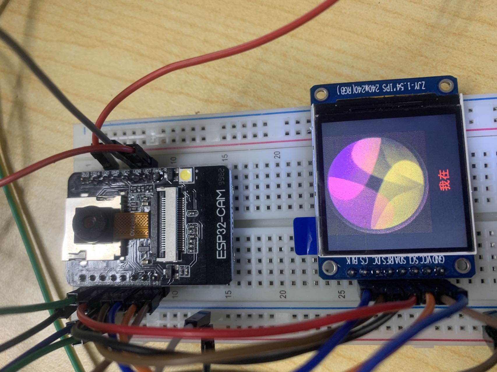

# 基于esp32的多功能小助手

>演示地址：https://www.bilibili.com/video/BV1aX4y117Zy/

## 概述

>手头正好有块esp32cam，又想玩一下esp32，于是乎，综合项目走起
>
>关键字：**LVGL**，**RTOS**，**FFT**，**ov2604**，**彩灯控制**，**网络API**
>
>

## 功能概述

>1. UI界面切换    已完成
>2. 开始动画   已完成
>3. 按键控制   已完成
>4. 语音控制   已完成
>5. 灯光控制   已完成
>6. 摄像头拍照   已完成
>7. FFT律动音乐   已完成
>8. 天气页面   已完成
>9. 主界面   已完成
>10. 课程表界面   已完成

## 项目架构

## 项目图片

